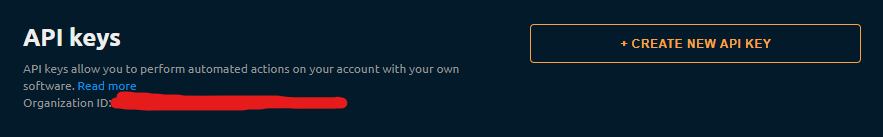
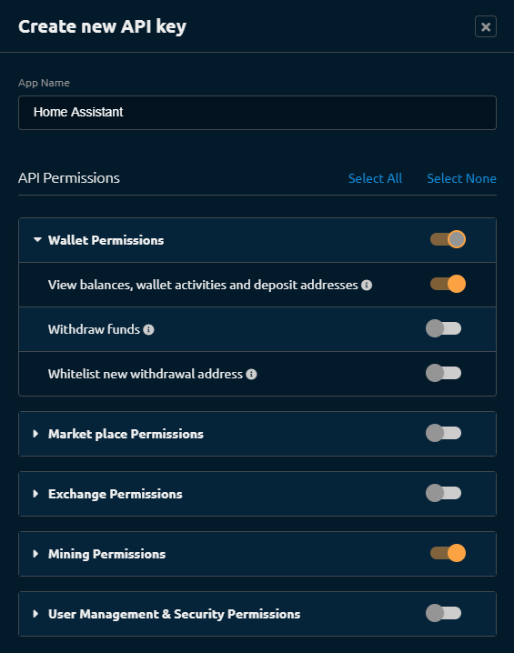

# NiceHash Api 

A Home Assistant integration to track your Nicehash rigs.

# HACS Install 
1. Access HACS: Open Home Assistant and click on HACS in the sidebar.
2. Go to Integrations: Navigate to the Integrations tab.
3. Add Custom Repository: Click on the menu in the top right corner (three vertical dots), then select Custom Repositories.
4. Enter Details: In the new window, you need to input the necessary information about the custom integration you want to add
5. Add custom repository URL: Paste the URL of the repository you want to add.
6. Select category: Choose 'Integration' from the category dropdown menu.
7. Add: Click the Add button to confirm. This action should add the custom integration to HACS.
8. Select "+ Explore & Download Repositories" and search for "NiceHash Api"
9. Select "NiceHash Api" and "Download this repository with HACS"
10. Once downloaded, go to settings, then devices and services
11. Click on add intergration and search for 'NiceHash Api'

## Enabling the integration

### Setup the API Key

You'll need to create an API key in NiceHash for this integration to work:
1. head over to your NiceHash account settings
1. Go into the API Keys menu
1. In this menu at the top, you'll find your Organisation ID which is required to later setup the integration in Home-Assistant

   

1. click `CREATE NEW API KEY`
1. This will present you with this popup:

   

1. :warning: Make sure you configure it like the above picture (**DO NOT ENABLE ANY OF THE OTHER SETTINGS**, this is at your own risk)
1. Click on `GENERATE API KEY`
1. This will give you 2 strings, note them down, you can't retrieve them later on:

   * The Key
   * The Secret

1. Validate the popup and enable the API Key (it will be through email)

### Setup Home Assistant

Once that is done, head over to Home-Assistant and add the integration from the integration menu:

1. Key and Secret: This is the key/secret you retrieved from the API Key creation
1. Org ID: This is the Organization ID
1. You're all set

 

